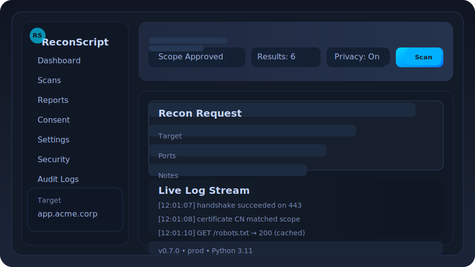

# ReconScript

<p align="center">
  
  
  
  
  
</p>

ReconScript delivers a professional-grade, read-only reconnaissance workflow for authorized security assessments. It blends a hardened Flask UI, CLI automation, and structured reporting so that teams can validate surface-level findings without risking active exploitation.



## Highlights

- **CISO-ready security** – Consent enforcement, CSRF protection, strict CSP, and SSRF guardrails baked in.
- **Deterministic operations** – Token-bucket rate limiting, pinned dependencies, reproducible Docker builds.
- **Actionable reporting** – Export JSON/HTML artifacts with signed hashes, audit trails, and sanitised logs.
- **Operator friendly** – Live log streaming, automatic browser launch (even from Docker/WSL), and ergonomic CLI.

## Quickstart

### Local environment
```bash
python3 -m venv .venv
source .venv/bin/activate
pip install -r requirements.txt
python -m reconscript --target 127.0.0.1 --ports 80 443 --format json
```

### Docker Compose
```bash
docker compose up --build
```
Then browse to <http://127.0.0.1:5000> (auto-launch enabled by default).

### One-line bootstrap
```bash
./start.sh
```
The helper script provisions a virtualenv, runs dependency audits, waits for `/health`, and opens the UI.

## Repository Layout

```
reconscript/
  cli.py           → Hardened CLI with consent validation
  config.py        → Centralised .env loading utilities
  core.py          → Recon orchestration & evidence guardrails
  scanner.py       → TCP/HTTP probes with throttling and sanitisation
  report.py        → Immutable report persistence and hashing
  ui.py            → Flask UI with RBAC, CSRF, Talisman headers, log streaming
  templates/       → Escaped Jinja templates (auto-escaped + CSP safe)
  static/          → JS/CSS assets
examples/          → Consent manifests and sample targets
tests/             → Pytest suites for CLI, scanner, and UI endpoints
docs/              → CHANGELOG, HELP, SECURITY guidance, screenshots
Dockerfile         → Non-root, reproducible build with pinned base image
pyproject.toml     → Project + dev dependency pins
```

## Security Design

| Control | Description |
| --- | --- |
| Consent enforcement | Non-local scans require a signed manifest; evidence levels checked against scope |
| Target validation | Rejects private/link-local ranges (unless explicitly allowed) and enforces hostname/IP alignment |
| Hardened UI | CSRF tokens, session hardening, Flask-Talisman headers (CSP, HSTS, Referrer, Permissions) |
| Safe networking | Only TCP connect + HTTP GET requests, TLS via `ssl.create_default_context()` |
| Results isolation | Reports stored within a locked `results/` sandbox with path traversal prevention |
| Sanitised logging | Optional anonymisation replaces IP/hostnames; secrets never written to disk |
| Error hygiene | Production errors surface friendly messaging without stack traces |
| Dependency hygiene | `pip-audit`, `safety`, `bandit`, `ruff`, and `pytest` baked into dev workflow |

Refer to [docs/SECURITY.md](docs/SECURITY.md) for the full posture summary and disclosure policy.

## Configuration

ReconScript prefers `.env` files for repeatable configuration. Copy `.env.example` and adjust values:

```ini
RECON_ENV=production
ENABLE_RBAC=true
DEFAULT_PORT=5000
RESULTS_DIR=results/secured
ANONYMIZE_LOGS=false
```

Environment variables are loaded via `reconscript.config.load_environment()` for the CLI, UI, and bootstrap scripts.

## Operational Workflow

1. **Prepare consent** – Obtain a JSON manifest describing the approved host/ports and sign-off parties.
2. **Launch ReconScript** – Via CLI (`reconscript ...`) or UI (`./start.sh` or Docker Compose).
3. **Execute scan** – TCP connect probe, HTTP metadata fetch, TLS parsing, robots.txt inspection.
4. **Review findings** – Live logs stream through the UI; detailed reports stored under `results/<uuid>/`.
5. **Archive evidence** – Reports include SHA-256 hashes and optional signature files for tamper detection.

## Testing & Quality Gates

```bash
pytest --maxfail=1 --disable-warnings -q
ruff check reconscript tests
bandit -q -r reconscript
safety check
pip-audit -r requirements.txt
```

Security reports and audit JSON outputs are written to `docs/` for traceability.

## Documentation

- [HELP](docs/HELP.md) – CLI usage, troubleshooting, manifest schema
- [CHANGELOG](docs/CHANGELOG.md) – Release history and upgrade notes
- [SECURITY](docs/SECURITY.md) – Security posture, disclosure policy, and safe-defaults summary

## License

MIT © Daniel Madden. Use ReconScript responsibly and only within legally authorised scopes.
